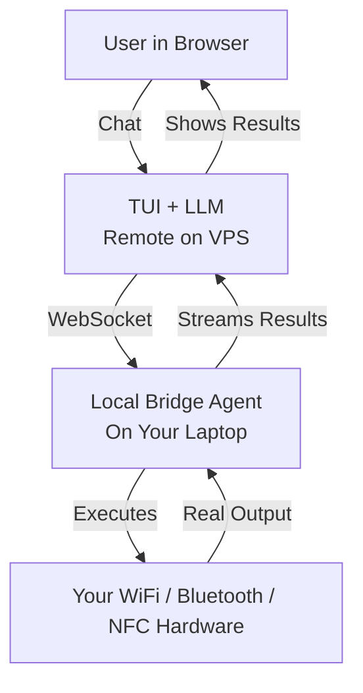
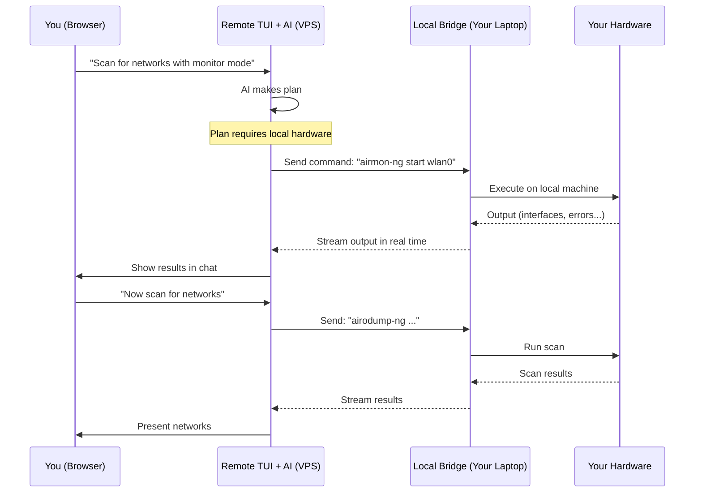

# Architecture & Flow (Clear Diagrams)

## 1. High-Level Architecture

**Key Point**: The AI brain is remote. Only the hardware execution is local.

## 2. Detailed User Flow

## 3. Text Version of the Flow

1. You type a request in the TUI.
2. The remote AI decides it needs your laptop's hardware.
3. It sends the command(s) to your running bridge over WebSocket.
4. Your bridge runs the command locally with full privileges.
5. Output (stdout + stderr) is streamed back instantly to the TUI.
6. The AI can chain multiple commands using real data from your machine.

## 4. What Runs Where

| Component              | Location          | What it does                          |
|------------------------|-------------------|---------------------------------------|
| LLM + Planning         | VPS (Docker)      | Thinking, planning, deciding what to run |
| Textual TUI            | VPS               | Your chat interface                   |
| Bridge Binary          | Your Laptop       | Connects to TUI, runs local commands  |
| Wireless Tools         | Your Laptop       | aircrack-ng, hcxdumptool, etc.        |
| Physical Adapters      | Your Laptop       | Your actual WiFi/Bluetooth/NFC cards  |

## 5. Connection Model

- The bridge always connects **outbound** to the VPS (you never open ports on your laptop).
- Authentication via token.
- Once connected, the TUI knows a bridge is available and can use it for hardware tasks.
